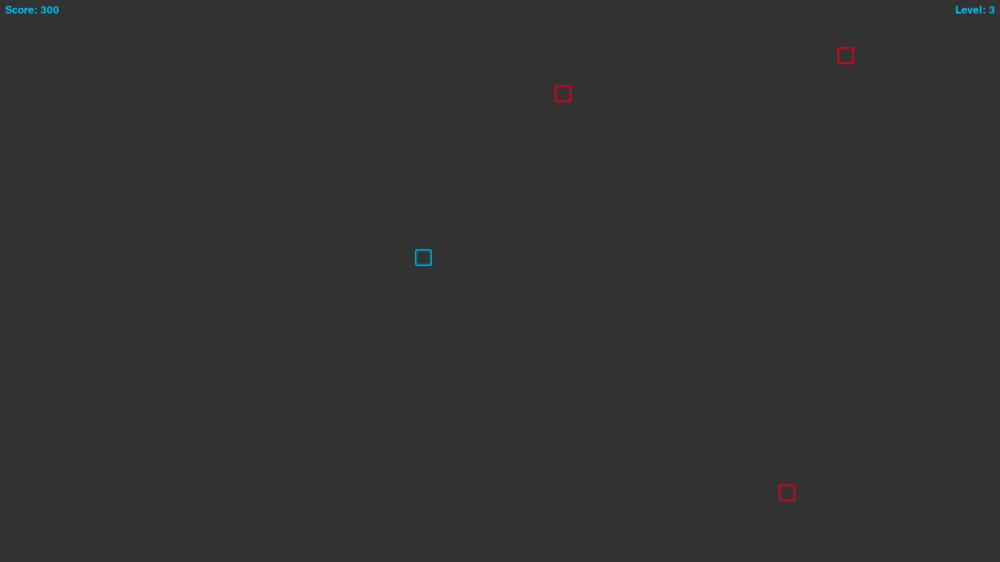

# <h1 align="center">🧱⚔️ BLOCK WARS ⚔️🧱</h1>



**Block Wars** is a fast-paced, neon-glowing arcade shooter where you control a glowing block battling waves of relentless enemies. Dodge and weave the full-screen arena, blast enemies with directional shots—including diagonals—and survive as long as possible while leveling up!

---

## 🎮 Gameplay Overview

You control a glowing blue block navigating the arena. Your goal is to:

* 🔫 Shoot enemies using keyboard, mouse, or controller — including diagonal shots with joystick!
* 🧟 Defeat increasingly faster enemies that chase you relentlessly
* 🛡️ Dodge collisions — one hit and it’s game over
* ⏫ Survive waves to level up and increase enemy speed and challenge

---

## 🕹️ Controls

### Keyboard

* **Move:** `W`, `A`, `S`, `D`
* **Shoot:** `Spacebar` or Left Mouse Button
* **Pause / Unpause:** `Esc`
* **Quit Game:** `Q` (only when paused)

### Controller (Optional)

* **Move:** Left Stick (supports 8 directions)
* **Shoot:** `A` button (fires in joystick direction)
* **Pause / Unpause:** `Start` button
* **Quit Game:** `X` button (only when paused)

---

## 📋 Features

* Fullscreen neon-glow aesthetic with smooth glowing edges
* Keyboard, mouse, and controller support with adaptive input handling
* Directional shooting including diagonal firing with joystick
* Controller rumble feedback on key events (player death, enemy hit)
* Increasing difficulty with waves and speed scaling
* Immersive looping background music and satisfying sound effects
* Pause screen with tailored instructions based on input method

---

## 🚀 Getting Started

Run the game using Python 3 and Pygame installed:

```bash
python3 blockwars-game.py

