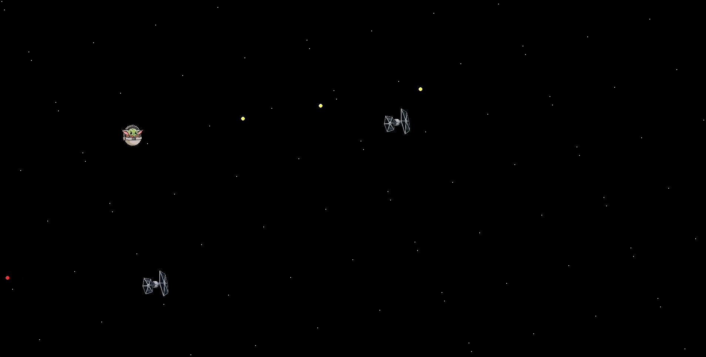

<h1 align="center">Grogu vs TIE Fighters</h1>



**Grogu vs TIE Fighters** is an action-packed, Star Wars-inspired arcade shooter made with Python and Pygame. Take control of Grogu (Baby Yoda) and fend off waves of TIE Fighters while dodging enemy fire and collecting points!

---

## Gameplay

- Control Grogu as he navigates across the screen.
- Shoot lasers to destroy incoming TIE Fighters.
- Avoid enemy bullets and collisions with TIE Fighters.
- Earn points for each enemy defeated.
- Survive as long as possible; the game ends when all lives are lost.
- Explosions and immersive sound effects enhance the gameplay experience.
- Background music loops continuously, and fades out on Game Over.

---

## Controls

| Action                   | Key / Mouse                |
|---------------------------|---------------------------|
| Move Up                   | `W`                       |
| Move Down                 | `S`                       |
| Move Left                 | `A`                       |
| Move Right                | `D`                       |
| Shoot Laser               | `Space` / Left Mouse Click|
| Quit / Exit Game          | `Esc` or `Q`              |

---

## Installation & Running

Make sure Python and Pygame are installed:

```bash
pip install pygame
python3 game-groguvstiefighters.py
