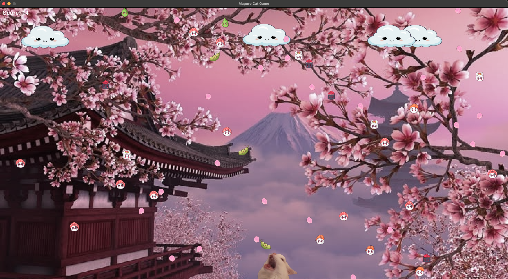

# <h1 align="center">🍣🐱 MAGURO CAT GAME 🐱🍣



**Maguro Cat Game** is a whimsical arcade-style game where you play as a sushi-loving cat! Catch delicious sushi, avoid the dreaded wasabi, and grow bigger with every bite. A soothing soundtrack and drifting petals set the tone for this cute yet challenging experience.

---

## 🎮 Gameplay Overview

You control a growing cat standing at the bottom of the screen. Sushi, edamame, and wasabi rain from the sky. Your job is to:

* 🥢 Catch sushi to score points and grow!
* 🫘 Catch edamame for bonus points.
* ❌ Avoid wasabi or it's game over!

As time progresses, objects fall faster, raising the stakes!

---

## 🕹️ Controls

### Keyboard

* **Move Left:** `A` or `←`
* **Move Right:** `D` or `→`
* **Pause / Unpause:** `Esc`
* **Quit Game:** `Q`

### Controller (Optional)

* **Move Left / Right:** Left Stick, Right Stick
* **Pause / Unpause:** `Start`
* **Quit Game:** `Start` then `X`

---

## 📋 Features

* Fullscreen immersive gameplay
* Controller and keyboard support
* Dynamic difficulty scaling over time
* Satisfying chomp and meow sound effects
* Growing cat mechanic
* Randomized sushi visuals and falling edamame
* Peaceful petals and drifting clouds

---

## 🚀 Getting Started

Run the game using Python (and Pygame):

```bash
python3 maguro-game.py
```
</h1>
